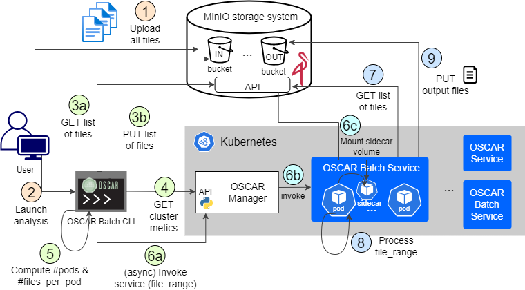

# OSCAR-Batch

OSCAR-Batch is a tool designed to perform batch-based processing using the [OSCAR](https://oscar.grycap.net/) service. OSCAR is an open-source platform built on Kubernetes for event-driven data processing of serverless applications packaged as Docker containers. The execution of these applications can be triggered both by detecting events from object-storage systems, such as MinIO or dCache (asynchronous calls) or by directly invoking them (synchronous calls). OSCAR Batch includes a coordinator service where the user provides a MinIO bucket containing files for processing. This service calculates the optimal number of parallel service invocations that can be accommodated within the cluster and distributes the image processing workload accordingly among the services. This is mainly intended to process large amounts of files, for example, historical data of an observatory service. It ensures the efficient use of available CPU and memory resources in the OSCAR cluster.

## Architecture

In the image above, the OSCAR-Bach architecture is represented. 

As a first step (1), the user needs to update the files to analyze to a bucket in a MinIO object storage service. This can be the default internal MinIO system that is available in every OSCAR cluster. Once the files are properly stored and accessible in the cluster, the analysis can be launched (2), taking into account that, previously, an OSCAR service with the application to analyze the files should be created. More details on how to create an OSCAR service can be read in the [official documentation](https://docs.oscar.grycap.net/oscar-service/).

In the second phase, the [coordinator](https://github.com/grycap/oscar-batch/blob/main/coordinator.py) takes the main role. It will compute the proper values for the number of parallel invocations to the service that the cluster can handle (taking into account the current values of free CPU and RAM memory in the cluster, and the CPU and RAM requirements of the service, all these metrics obtained via the [OSCAR API](https://docs.oscar.grycap.net/api/) (4)), and the amount of files each invocation can process to cover the complete analysis of the files contained in the bucket (5). For this last value, the coordinator lists the content of the MinIO bucket (3a) and saves it in a file in the same bucket (3b). The last step covered by the coordinator is the invocation of the service (6a).

The third phase is managed by OSCAR Manager, which will trigger the actual execution of the services inside the cluster (6b) (as depicted in the figure, OSCAR runs on top of a Kubernetes cluster). In order to avoid copying the content of the MinIO bucket (which can be huge, as this OSCAR-Batch tool is intended for large amounts of files), OSCAR uses a strategy based on sidecar containers (6c), where the content of the MinIO bucket is mounted as a volume and accessible for the instance of the service (a K8s pod).

Finally, the last phase is the execution of the service itself, which will commonly consist of an inference execution of a pre-trained AI model, able to analyze (8) the files contained in the MinIO bucket (each instance of the service will analyze a range of them (7)). The inference process stores the output of each analysis in MinIO (9). The user can now access the outputs stored in the MinIO bucket.

## Configuration file
The OSCAR-Batch coordinator can be easily configured by providing a JSON file like the [config.json](https://github.com/grycap/oscar-batch/blob/main/config.json). It collects the info regarding the MinIO object storage system (including endpoint, access credentials, bucket name and folder), the OSCAR cluster (involving also the endpoint and the access credentials), and the name of the service to be executed.

Notice that the repo provides a small script to generate the config file programatically. See [gen-config-file.py](https://github.com/grycap/oscar-batch/blob/main/gen-config-file.py).

For more documentation regarding OSCAR, visit https://grycap.github.io/oscar/. For more details on how the coordinator works, you can refer to the code provided in this repo.

> **_NOTE:_** If you detect inaccurate or unclear information on the documentation please report back to us either opening an issue or contacting us at products@grycap.upv.es

## Licensing

OSCAR-Batch is licensed under the Apache License, Version 2.0. See [LICENSE](https://github.com/grycap/oscar-batch/blob/main/LICENSE) for the full license text.

## Acknowledgements

This development is partially funded by the project [AI4EOSC](https://ai4eosc.eu/) "Artificial Intelligence for the European Open Science Cloud", that has received funding from the European Union’s HORIZON-INFRA-2021-EOSC-01 Programme under Grant 101058593. 

It is also partially funded by the project [iMagine](https://www.imagine-ai.eu/) "Imaging data and services for aquatic science", which has received funding from the European Union Horizon Europe Programme – Grant Agreement number 101058625.
