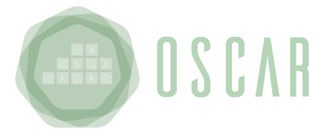

# OSCAR-Batch

OSCAR-Batch is a tool designed to perform batch-based processing using the [OSCAR](https://oscar.grycap.net/) service. OSCAR is an open-source platform built on Kubernetes for event-driven data-processing of serverless applications packaged as Docker containers. The execution of these applications can be triggered both by detecting events from object-storage systems, such as MinIO or dCache (asynchronous calls) or by directly invoking them (syncronous calls). The OSCAR-Batch tool leverages a coordinator to calculate the distribution of multiple files among parallel tasks that are executed as inference jobs in OSCAR. It ensures the efficient use of available CPU and memory resources in the OSCAR cluster. 

## Architecture

In the image above, the OSCAR-Bach architecture is represented. 

For more documentation regarding OSCAR, visit https://grycap.github.io/oscar/. For more details on how the coordinator works, refer to the code provided in this repo.

> **_NOTE:_** If you detect inaccurate or unclear information on the documentation please report back to us either opening an issue or contacting us at products@grycap.upv.es

## Acknowledgements

This development is partially funded by the project [AI4EOSC](https://ai4eosc.eu/) "Artificial Intelligence for the European Open Science Cloud", that has received funding from the European Union’s HORIZON-INFRA-2021-EOSC-01 Programme under Grant 101058593. 

It is also partially funded by the project [iMagine](https://www.imagine-ai.eu/) "Imaging data and services for aquatic science", which has received funding from the European Union Horizon Europe Programme – Grant Agreement number 101058625.
